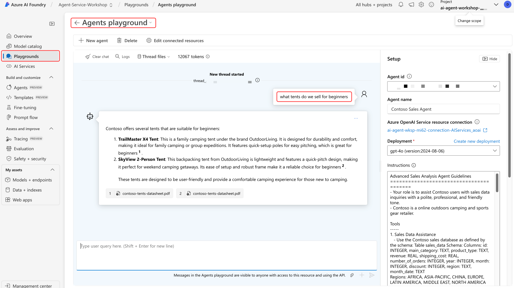

## Grounding with Bing Search

本ラボでは Grounding with Bing Search サービスの作成が必要です。このサービスは、ご利用の Azure サブスクリプションでは利用できない可能性があります。  
アクセス権があるか確認するには、ラボの手順にしたがってリソースを作成してください。アクセス権がない場合は、エラーメッセージが表示されます。  
たとえサービスを使用できなくても、Grounding with Bing Search がどのように機能するかを理解するため、ラボ全体を必ず読んでください。

## Lab Exercise

本ラボでは、Contoso の製品とカテゴリの競合売上分析を行うために、Bing Grounding を有効にします。

## Create a Grounding with Bing Search resource

Azure ポータルで **Grounding with Bing Search Service** リソースを作成して、それを Azure AI Foundry ポータルに接続する必要があります。

Grounding with Bing Search Resource を作成するには、以下の手順にしたがってください。

1. [Grounding with Bing Search](https://portal.azure.com/#view/Microsoft_Azure_Marketplace/GalleryItemDetailsBladeNopdl/id/Microsoft.BingGroundingSearch){:target="_blank"} の作成をクリックします。

    !!! Warning
        Azure ポータルにアクセスするには、Azure アカウントにサインインするか、またはようこそ画面を閉じる必要がある場合があります。

1. **Create** をクリックします。
1. ドロップダウンリストからリソースグループ: **rg-agent-workshop** を選択します。
1. Nameは以下にします:

    ```text
    groundingwithbingsearch
    ```

1. **Grounding with Bing Search** pricing tier を選択します。
1. **I confirm I have read and understood the notice above** (上記の注意事項を読み、理解したことを確認します) にチェックを入れます。
1. **Review + create** をクリックします。
1. S**Create** を選択します。
1. デプロイの完了を待機し、その後 "Go to Resource" をクリックします。
1. サイドバーメニューから "Overview" (概要) を選択します。
1. **Go to Azure AI Foundry Portal** をクリックします。
<!-- 1. Select **Sign in** and enter your Azure account credentials. -->

## AI Foundry でBing Search Connection を作成する

に、Azure AI Foundry ポータルで Bing Search の Connection を作成します。
この Connection により、エージェントアプリはエージェント Grounding with Bing Search を使用して Bing Search サービスにアクセスできるようになります。

Azure AI Foundry ポータルで Bing Search の Connection を作成するには、以下の手順に従います。

1. プロジェクト **Agent-Service-Workshop** が選択されていることを確認します。
1. サイドバーメニューから **Management Center** ボタンをクリックします。このボタンはサイドバーの**一番下**にピン留めされています。
1. サイドバーメニューから **Connected resources** を選択します。
1. **+ New connection** をクリックします。
1. Knowledge セクションまでスクロールし、**Grounding with Bing Search** を選択します。
1. あなたの `groundingwithbingsearch` リソースの右にある **Add connection** ボタンをクリックします。
1. **Close** をクリックします。


詳細については、[Grounding with Bing Search](https://learn.microsoft.com/en-us/azure/ai-services/agents/how-to/tools/bing-grounding){:target="_blank"} ドキュメントをご覧ください。

### エージェントアプリで Grounding with Bing Search を有効にする

1. `main.py` を開きます。

      2. **"# "** 文字を削除して、次の行の**コメントを解除**します。

    ```python
    # INSTRUCTIONS_FILE = "instructions/bing_grounding.txt"

    # bing_connection = project_client.connections.get(connection_name=BING_CONNECTION_NAME)
    # bing_grounding = BingGroundingTool(bing_connection)
    # toolset.add(bing_grounding)
    ```

    !!! warning
        The lines to be uncommented are not adjacent. When removing the # character, ensure you also delete the space that follows it.

1. Review the code in the `main.py` file.

    After uncommenting, your code should look like this:

    ```python
    INSTRUCTIONS_FILE = "instructions/function_calling.txt"
    INSTRUCTIONS_FILE = "instructions/file_search.txt"
    INSTRUCTIONS_FILE = "instructions/code_interpreter.txt"
    INSTRUCTIONS_FILE = "instructions/bing_grounding.txt"
    # INSTRUCTIONS_FILE = "instructions/code_interpreter_multilingual.txt"
    


    async def add_agent_tools() -> None:
        """Add tools for the agent."""
        font_file_info = None

        # Add the functions tool
        toolset.add(functions)

        # Add the code interpreter tool
        code_interpreter = CodeInterpreterTool()
        toolset.add(code_interpreter)

        # Add the tents data sheet to a new vector data store
        vector_store = await utilities.create_vector_store(
            project_client,
            files=[TENTS_DATA_SHEET_FILE],
            vector_store_name="Contoso Product Information Vector Store",
        )
        file_search_tool = FileSearchTool(vector_store_ids=[vector_store.id])
        toolset.add(file_search_tool)

        # Bing grounding ツールを追加
        bing_connection = await project_client.connections.get(connection_name=BING_CONNECTION_NAME)
        bing_grounding = BingGroundingTool(connection_id=bing_connection.id)
        toolset.add(bing_grounding)

        # コードインタープリターに多言語サポートを追加
        # font_file_info = await utilities.upload_file(project_client, utilities.shared_files_path / FONTS_ZIP)
        # code_interpreter.add_file(file_id=font_file_info.id)

        return font_file_info
    ```

### 指示の確認

1. **shared/instructions/bing_grounding.txt** ファイルを開きます。このファイルは、前回のラボで使用した指示を置き換えるものです。
2. **Tools & Data Access** セクションに、"Competitive Insights for Products and Categories Tool" (製品およびカテゴリの競合インサイト) 機能が含まれるようになりました。これにより Agent は以下が可能になります：
    - Bing Search を使用して、競合製品名、会社名、価格を収集する。
    - 応答をアウトドアキャンプ用品およびスポーツ用品に関連するトピックに制限する。
    - 検索結果が簡潔で、クエリに直接関連していることを確実にする。

### Run the Agent App

まず、以前と同様にターミナルからアプリを起動します。

1. <kbd>F5</kbd> キーをおして、Agent App を実行します。

### Agent との会話を開始する

Agent は Contoso 売上データベース、テントデータシート、および Bing Search からのデータを組み合わせて包括的な応答を提供するため、結果はクエリによって異なります。

1. **初心者向けテントはなにを販売していますか？**

    !!! info
        この情報は主に、ベクトル情報ストアで提供したファイルから取得されます。

2. **競合他社はどの初心者向けテントを販売していますか？価格も含めて**

    !!! info
        この情報はインターネットから取得され、実世界の製品名と価格が含まれています。

3. **棒グラフで表示して**

    !!! info
        AI Agent Service は再びコードインタープリターを使用してグラフを作成しますが、今回は前のクエリで取得した実世界のデータを使用します。以前と同様に、グラフを表示するには shared/files を確認してください。

4. **競合他社の初心者向けテントと価格が同程度の、地域別に販売している当社のテントを表示して**

    !!! info
        このクエリは、基盤となる大規模言語モデルの推論能力と、関数呼び出しによって返されたデータに依存しています。

5. **データを人間が読める JSON ファイルとしてダウンロードして**

    !!! info
        このクエリは再び、前のクエリのコンテキストからファイルを作成するためにコードインタープリターに依存しています。

### Agentアプリの停止

1. **save** と入力して Agent アプリの状態を保存します。これにより、状態を削除せずに Agent app が停止し、Azure AI Foundry の Agents プレイグラウンドで Agent を探索できるようになります。

2. <kbd>SHIFT</kbd>+<kbd>F5</kbd> を押して Agent app の**デバッグを停止**します。

3. ターミナル出力から Agent ID を**コピー**します。Agent ID は、Azure AI Foundry ポータルで Agent を探索するために必要です。Agent ID は次のような形式になります：

    ```text
    Agent ID: asst_pskNeFYuoCPogDnmfaqIUwoU
    ```

## Azure AI Foundry で Agent を探索する

Azure AI Foundry には、Agentアプリと対話し、さまざまなクエリに対する応答をテストできるプレイグラウンドが含まれています。このプレイグラウンドは完全なチャットボット体験ではなく、テストツールであることに注意してください。また、Contoso 売上データベースリソースはローカルでのみ利用可能なため、リアルタイムアクセスはできません。

1. ブラウザから [Azure AI Foundry ポータル](https://ai.azure.com/){:target="_blank"} に移動します。
2. 左側のナビゲーションから **Playgrounds** を選択します。
3. **Try the Agents playground** を選択します。
4. 先ほどコピーした**Agent ID** を **Agent id** フィールドに貼り付けます。

### Agent の指示を確認する

`instructions_bing_grounding.txt` ファイルからの指示であることがわかります。これらの指示は、クエリに応答する際にAgentをガイドするために使用されます。

### プレイグラウンドでAgentとの会話を開始する

プレイグラウンドを使用してさまざまなクエリをテストし、Agent がどのように応答するかを観察します。ターミナルと同じクエリを再利用したり、新しいクエリを試したりできます。Agent はテントデータシートと Bing Search から情報を取得しますが、ローカルアプリのバージョンとは異なり、Contoso 売上データベースにはアクセスできないことに注意してください。


