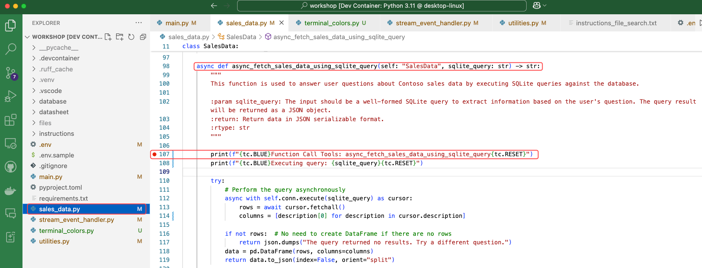

## はじめに

### Function Calling とは

Function calling により、大規模言語モデルは外部システムと対話できるようになります。LLM は、指示、Function の定義、およびユーザープロンプトに基づいて、いつ Function を呼び出すかを決定します。その後、LLM は構造化データを返し、エージェントアプリはそれを使用して Function を呼び出すことができます。

エージェントアプリ内に Function のロジックを実装するのは開発者の責任です。このワークショップでは、LLM によって動的に生成される SQLite クエリを実行するために Function ロジックを使用します。

### Function Calling の有効化

[Azure OpenAI Function calling](https://learn.microsoft.com/azure/ai-services/openai/how-to/function-calling){:target="_blank"} に精通している方は、LLM 用に関数スキーマを定義する必要があることをご存知でしょう。

=== "Python"

    Azure AI Agent Service とその Python SDK を使用すると、Python 関数の docstring 内で直接関数スキーマを定義できます。このアプローチにより、定義と実装が一緒に保たれ、メンテナンスが簡素化され、可読性が向上します。

    例えば、**sales_data.py** ファイルでは、**async_fetch_sales_data_using_sqlite_query** 関数が docstring を使用して、そのシグネチャ、入力、および出力を指定します。SDK はこの docstring を解析して、LLM 用の呼び出し可能な関数を生成します：

    ```python

    async def async_fetch_sales_data_using_sqlite_query(self: "SalesData", sqlite_query: str) -> str:
        """
        この関数は、データベースに対して SQLite クエリを実行することにより、Contoso の売上データに関するユーザーの質問に答えるために使用されます。

        :param sqlite_query: 入力は、ユーザーの質問に基づいて情報を抽出するための、整形式の SQLite クエリである必要があります。クエリ結果は JSON オブジェクトとして返されます。
        :return: JSON シリアライズ可能な形式でデータを返します。
        :rtype: str
        """
    ```

=== "C#"

    Azure AI Agent Service とその .NET SDK を使用する場合、エージェントに関数を追加する際に C# コードの一部として関数スキーマを定義します。

    例えば、**Lab.cs** ファイルでは、`InitialiseTools` メソッドが `WorkspaceSalesDataAsync` 関数の関数スキーマを定義します：

    ```csharp
    new FunctionToolDefinition(
        name: nameof(SalesData.FetchSalesDataAsync),
        description: "This function is used to answer user questions about Contoso sales data by executing SQLite queries against the database.",
        parameters: BinaryData.FromObjectAsJson(new {
            Type = "object",
            Properties = new {
                Query = new {
                    Type = "string",
                    Description = "The input should be a well-formed SQLite query to extract information based on the user's question. The query result will be returned as a JSON object."
                }
            },
            Required = new [] { "query" }
        },
        new JsonSerializerOptions() { PropertyNamingPolicy = JsonNamingPolicy.CamelCase })
    )
    ```

### 動的な SQL 生成

アプリが起動すると、データベーススキーマと主要なデータを Azure AI Agent Service の指示に組み込みます。この入力を使用して、LLM は自然言語で表現されたユーザーのリクエストに応答するために、SQLite 互換の SQL クエリを生成します。

## ラボ演習

このラボでは、SQLite データベースに対して動的 SQL クエリを実行する関数ロジックを有効にします。この関数は、Contoso の売上データに関するユーザーの質問に答えるために LLM によって呼び出されます。

=== "Python"

    1. `main.py` を開きます。

    2. **"# "** 文字を削除して、次の行の**コメントを解除**します。

        ```python
        # INSTRUCTIONS_FILE = "instructions/instructions_function_calling.txt"

        # toolset.add(functions)
        ```

        !!! warning
            コメント解除する行は隣接していません。#文字を削除する際は、それに続くスペースも忘れずに削除してください。選択したコードセクションをより素早くコメント解除するには、ショートカット CTRL-K + CTRL-U を使用するとよいでしょう。

    3. main.py のコードを確認します。

        コメント解除後、コードは次のようになります：

        ``` python
        # INSTRUCTIONS_FILE = "instructions/function_calling.txt"
        # INSTRUCTIONS_FILE = "instructions/file_search.txt"
        # INSTRUCTIONS_FILE = "instructions/code_interpreter.txt"
        # INSTRUCTIONS_FILE = "instructions/bing_grounding.txt"
        # INSTRUCTIONS_FILE = "instructions/code_interpreter_multilingual.txt"


        async def add_agent_tools() -> None:
            """Add tools for the agent."""
            font_file_info = None

            # functions tool の追加
            toolset.add(functions)

            # テントのデータシートを新しいベクトルデータストアに追加
            # vector_store = await utilities.create_vector_store(
            #     project_client,
            #     files=[TENTS_DATA_SHEET_FILE],
            #     vector_store_name="Contoso Product Information Vector Store",
            # )
            # file_search_tool = FileSearchTool(vector_store_ids=[vector_store.id])
            # toolset.add(file_search_tool)

            # コードインタープリターツールを追加
            # code_interpreter = CodeInterpreterTool()
            # toolset.add(code_interpreter)

            # Bing grounding ツールを追加
            # bing_connection = await project_client.connections.get(connection_name=BING_CONNECTION_NAME)
            # bing_grounding = BingGroundingTool(connection_id=bing_connection.id)
            # toolset.add(bing_grounding)

            # コードインタープリターに多言語サポートを追加
            # font_file_info = await utilities.upload_file(project_client, utilities.shared_files_path / FONTS_ZIP)
            # code_interpreter.add_file(file_id=font_file_info.id)

            return font_file_info
        ```

=== "C#"

    1. `Program.cs` ファイルを開きます。

    2. 次のコードの**コメントを解除**し、更新します：

        ```csharp
        await using Lab lab = new Lab1(projectClient, apiDeploymentName);
        await lab.RunAsync();
        ```

### 指示の確認

 1. **shared/instructions/function_calling.txt** ファイルを開きます。

    !!! tip "VS Code では、Alt + Z (Windows/Linux) または Option + Z (Mac) を押すと折り返しモードが有効になり、指示が読みやすくなります。"

 2. 指示がエージェントアプリの動作をどのように定義しているかを確認します：

    * **役割定義**: エージェントは、丁寧、プロフェッショナル、かつフレンドリーな態度で、Contoso ユーザーの売上データに関する問い合わせを支援します。
    * **コンテキスト**: Contoso は、キャンプ用品とスポーツ用品を専門とするオンライン小売業者です。
    * **ツール説明 – 「売上データ支援」**:
        * エージェントが SQL クエリを生成および実行できるようにします。
        * クエリ構築のためのデータベーススキーマの詳細が含まれます。
        * 結果を集計データに限定し、最大行数は 30 行とします。
        * 出力を Markdown テーブルとしてフォーマットします。
    * **応答ガイダンス**: 実用的で関連性の高い返信を強調します。
    * **ユーザーサポートのヒント**: ユーザーを支援するための提案を提供します。
    * **安全性と行動**: 不明瞭、範囲外、または悪意のあるクエリへの対処方法をカバーします。

    ワークショップ中に、エージェントの能力を強化するために新しいツールを導入して、これらの指示を拡張します。

    !!! info
        指示内の {database_schema_string} プレースホルダーは、アプリの初期化時にデータベーススキーマに置き換えられます。

        === "Python"

            ```python
            # プレースホルダーをデータベーススキーマ文字列に置き換える
            instructions = instructions.replace("{database_schema_string}", database_schema_string)
            ```

        === "C#"

            ```csharp
            // プレースホルダーをデータベーススキーマ文字列に置き換える
            instructions = instructions.Replace("{database_schema_string}", databaseSchemaString);
            ```

## Agent App の実行

1. <kbd>F5</kbd> を押してアプリを実行します。
2. ターミナルにアプリの起動が表示され、エージェントアプリから**クエリを入力してください (Enter your query)** というプロンプトが表示されます。

    {:width="600"}

### エージェントとの会話を開始する

Contoso の売上データに関する質問を始めてください。例：

1. **何ができますか**

    **何ができますか** クエリに対する LLM の応答例です：

    *Contoso の売上データに関するお問い合わせをお手伝いします。どのようなサポートが必要か、詳細を教えていただけますか？以下に考慮できるクエリの例をいくつか示します：*

    * *地域別の売上はどうでしたか？*
    * *前四半期の収益はどうでしたか？*
    * *ヨーロッパで最も売れている製品は何ですか？*
    * *地域別の総輸送コストは？*

    *Contoso の売上データに関連する具体的な質問があれば、お気軽にお尋ねください！*

    !!! tip
        LLM は、指示ファイルで定義された開始用の質問リストを提供します。あなたの言語で助けを求めてみてください。例えば、`help in Hindi`、`help in Italian`、`help in Korean` のように。

2. **最新の取引詳細を3件表示して**

    応答では、SQLite データベースに保存されている生データを確認できます。各レコードは Contoso の単一の販売トランザクションであり、製品、製品カテゴリ、販売額と地域、日付などの情報が含まれています。

    !!! warning
        エージェントは、「個々の取引詳細は提供できません (I'm unable to provide individual transaction details)」のようなメッセージで、このクエリへの応答を拒否する場合があります。これは、指示がデフォルトで「集計結果を提供する (provide aggregated results by default)」ように指示しているためです。もしそうなった場合は、再試行するか、クエリを言い換えてください。

        大規模言語モデルは非決定的な動作をするため、同じクエリを繰り返しても異なる応答を返すことがあります。

3. **地域別の売上は**

    **地域別の売上は** クエリに対する LLM の応答例です：

        | Region         | Total Revenue  |
        |----------------|----------------|
        | AFRICA         | $5,227,467     |
        | ASIA-PACIFIC   | $5,363,718     |
        | CHINA          | $10,540,412    |
        | EUROPE         | $9,990,708     |
        | LATIN AMERICA  | $5,386,552     |
        | MIDDLE EAST    | $5,312,519     |
        | NORTH AMERICA  | $15,986,462    |

    !!! info
        では、舞台裏では何が起こってすべてが機能しているのでしょうか？

        LLM は次のステップを調整します：

        1. LLM はユーザーの質問に答えるための SQL クエリを生成します。質問 **「地域別の売上は」** に対しては、次の SQL クエリが生成されます：

            **SELECT region, SUM(revenue) AS total_revenue FROM sales_data GROUP BY region;**

        2. 次に LLM はエージェントアプリに **async_fetch_sales_data_using_sqlite_query** 関数を呼び出すよう要求します。この関数は SQLite データベースから必要なデータを取得し、LLM に返します。
        3. LLM は取得したデータを使用して Markdown テーブルを作成し、それをユーザーに返します。指示ファイルを確認すると、Markdown がデフォルトの出力形式であることがわかります。

4. **ヨーロッパでのカテゴリ別売上を表示して**

    この場合、さらに複雑な SQL クエリがエージェントアプリによって実行されます。

5. **footwear の売り上げの内訳を教えて**

    エージェントがどの製品が「footwear (履物)」カテゴリに該当するかを把握し、「**内訳 (breakout)**」という用語の背後にある意図を理解していることに注目してください。

6. **当社ではどのようなブランドのテントを取り扱っていますか？**

!!! info
    製品ブランドに関する情報を含むデータをエージェントに提供していません。そのため、エージェントはこの質問に適切に回答できません。

    以前の応答で、基になるデータベースからのトランザクション履歴にも製品ブランドや説明が含まれていなかったことに気づかれたかもしれません。次のラボでこれを修正します！

## (オプション) アプリのデバッグ

`sales_data.py` にある `async_fetch_sales_data_using_sqlite_query` 関数に[ブレークポイント](https://code.visualstudio.com/Docs/editor/debugging){:target="_blank"}を設定して、LLM がどのようにデータを要求するかを観察します。

!!! info "注意：デバッグ機能を使用するには、前の実行を終了します。次にブレークポイントを設定します。その後、サイドバーのデバッガーアイコンを使用してアプリケーションを実行します。これによりデバッグサイドバーが開き、スタックトレースを確認したり、実行をステップ実行したりできます。"

{:width="600"}

### さらに質問する

ブレークポイントを設定したので、Contoso の売上データについて追加の質問をして、関数ロジックの動作を観察します。関数をステップ実行してデータベースクエリを実行し、結果を LLM に返します。

これらの質問を試してみてください：

1. **最も売上が高い地域は?**
2. **2022年4月のアメリカでのテントの売上は?**

### ブレークポイントの無効化

アプリを再度実行する前に、ブレークポイントを無効にすることを忘れないでください。

### Agent App の停止

完了したら、**exit** と入力して Agent のリソースをクリーンアップし、アプリを停止します。
