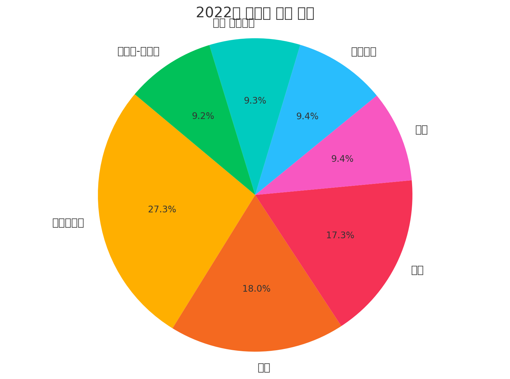

## はじめに

「Lab 2🧪ドキュメントのグラウンディング」では、会話にドキュメントのコンテキストを提供するために PDF ファイルをアップロードしました。今回は、多言語の視覚化のためのフォントを含む ZIP ファイルをアップロードしてコードインタープリターを強化します。これは、[ファイルのアップロード](https://learn.microsoft.com/azure/ai-services/agents/how-to/tools/code-interpreter){:target="_blank"} がその機能を拡張する方法の一例にすぎません。

!!! note
    コードインタープリターには、デフォルトでラテン文字ベースのフォントセットが含まれています。コードインタープリターはサンドボックス化された Python 環境で実行されるため、インターネットから直接フォントをダウンロードすることはできません。

## ラボ演習

以前のラボでは、必要なフォント ZIP ファイルをアップロードしてコードインタープリターにリンクするのに時間がかかるため、多言語サポートは含まれていませんでした。このラボでは、必要なフォントをアップロードして多言語サポートを有効にします。また、拡張された指示を使用してコードインタープリターをガイドするためのヒントも学びます。

## 前のラボを再実行する

まず、コードインタープリターが多言語テキストをどのようにサポートするか（現状）を確認するために、前のラボを再実行します。

1. <kbd>F5</kbd> を押してAgent app を開始します。

2. ターミナルでアプリが起動し、Agent app から**クエリを入力してください (Enter your query)** というプロンプトが表示されます。

3. これらの質問を試してみてください：

    1. **2023年の地域別売上は？**

    2. **円グラフで表示してください**

        タスクが完了すると、円グラフの画像が **shared/files** サブフォルダーに保存されます。視覚化を確認すると、テキストが正しくレンダリングされていないことがわかります。これは、コードインタープリターに必要な非ラテン文字をレンダリングするためのフォントがないためです。

        {width=75%}

4. 完了したら、**exit** と入力してAgent のリソースをクリーンアップし、アプリを停止します。

## 多言語フォントサポートの追加

=== "Python"

    1. `main.py` を開きます。

    2. Agent用に新しい指示ファイルを定義します： **"# "** 文字を削除して、次の行の**コメントを解除**します

        ```python
        # INSTRUCTIONS_FILE = "instructions/code_interpreter_multilingual.txt"

        # font_file_info = await utilities.upload_file(project_client, utilities.shared_files_path / FONTS_ZIP)
        # code_interpreter.add_file(file_id=font_file_info.id)
        ```

        !!! warning
            コメント解除する行は隣接していません。# 文字を削除する際は、その後のスペースも削除するようにしてください。

    3. `main.py` ファイルのコードを確認します。

        コメント解除後、コードは次のようになります：

        ```python
        INSTRUCTIONS_FILE = "instructions/function_calling.txt"
        INSTRUCTIONS_FILE = "instructions/file_search.txt"
        INSTRUCTIONS_FILE = "instructions/code_interpreter.txt"
        INSTRUCTIONS_FILE = "instructions/bing_grounding.txt"
        INSTRUCTIONS_FILE = "instructions/code_interpreter_multilingual.txt"


        async def add_agent_tools() -> None:
            """Add tools for the agent."""
            font_file_info = None

            # 関数ツールを追加
            toolset.add(functions)

            # コードインタープリターツールを追加
            code_interpreter = CodeInterpreterTool()
            toolset.add(code_interpreter)

            # テントのデータシートを新しいベクトルデータストアに追加
            vector_store = await utilities.create_vector_store(
                project_client,
                files=[TENTS_DATA_SHEET_FILE],
                vector_store_name="Contoso Product Information Vector Store",
            )
            file_search_tool = FileSearchTool(vector_store_ids=[vector_store.id])
            toolset.add(file_search_tool)

            # Bing grounding ツールを追加
            bing_connection = await project_client.connections.get(connection_name=BING_CONNECTION_NAME)
            bing_grounding = BingGroundingTool(connection_id=bing_connection.id)
            toolset.add(bing_grounding)

            # コードインタープリターに多言語サポートを追加
            font_file_info = await utilities.upload_file(project_client, utilities.shared_files_path / FONTS_ZIP)
            code_interpreter.add_file(file_id=font_file_info.id)
            return font_file_info
        ```

=== "C#"

    1. `Program.cs` ファイルを開きます。

    2. ラボの作成を `Lab2` クラスを使用するように**更新**します。

        ``` csharp
        await using Lab lab = new Lab5(projectClient, apiDeploymentName);
        ```

    3. `Lab4.cs` クラスを確認し、コードインタープリターがツールリストにどのように追加されるかを確認します。

## 指示の確認

1. **shared/instructions/code_interpreter_multilingual.txt** ファイルを開きます。このファイルは、前のラボで使用された指示を置き換えます。
2. **ツール**セクションには、視覚化の作成方法と非ラテン言語の処理方法を説明する、拡張された「視覚化とコード解釈 (Visualization and Code Interpretation)」セクションが含まれるようになりました。

    以下は、コードインタープリターに与えられた指示の要約です：

    * **非ラテン文字（例：アラビア語、日本語、韓国語、ヒンディー語）のフォント設定：**
        * 初回実行時に、`/mnt/data/fonts` フォルダーが存在するか確認します。存在しない場合は、フォントファイルをこのフォルダーに解凍します。
        * **利用可能なフォント：**
            * アラビア語： `CairoRegular.ttf`
            * ヒンディー語： `NotoSansDevanagariRegular.ttf`
            * 韓国語： `NanumGothicRegular.ttf`
            * 日本語： `NotoSansJPRegular.ttf`

    * **フォントの使用法：**
        * 正しいパスを使用して `matplotlib.font_manager.FontProperties` でフォントを読み込みます。
        * フォントを適用する対象：
            * `fontproperties` パラメーターを使用して `plt.title()` に。
            * `plt.pie()` や `plt.bar_label()` のような関数で `textprops={'fontproperties': font_prop}` を使用して、すべてのラベルとテキストに。
        * すべてのテキスト（ラベル、タイトル、凡例）が、豆腐（□）や疑問符なしで正しくエンコードされていることを確認します。

    * **視覚化テキスト：**
        * 常にデータを要求された言語または推測された言語（例：中国語、フランス語、英語）に翻訳します。
        * すべてのグラフテキスト（例：タイトル、ラベル）には `/mnt/data/fonts/fonts` から適切なフォントを使用します。

## Agent app の実行

1. <kbd>F5</kbd> を押してアプリを実行します。
2. ターミナルでアプリが起動し、Agent app から**クエリを入力してください (Enter your query)** というプロンプトが表示されます。

### Agent との会話を開始する

これらの質問を試してみてください：

    1.  **2023年の地域別売上は？**

    2.  **円グラフで表示してください**

    タスクが完了すると、文字化けしていない円グラフの画像が **shared/files** サブフォルダに保存されます。

## コードインタープリターのデバッグ

コードインタープリターを直接デバッグすることはできませんが、Agent に生成したコードを表示させることで、その動作についての洞察を得ることができます。これにより、Agent が指示をどのように解釈するかを理解し、指示を改善するのに役立ちます。

ターミナルから、次のように入力します：

1. **コードを表示して** と入力して、最後の視覚化のためにコードインタープリターが生成したコードを確認します。
2. **/mnt/data にマウントしたファイルの一覧を教えて** と入力して、コードインタープリターにアップロードされたファイルを確認します。

## コードインタープリター出力の制限

エンドユーザーには、コードインタープリターが生成したコードを見せたり、アップロードまたは作成されたファイルにアクセスさせたりしたくないでしょう。これを防ぐには、コードインタープリターがコードを表示したりファイルをリストしたりすることを制限する指示を追加します。

例として、`code_interpreter_multilingual.txt` ファイルの `### c. Visualization and Code Interpretation Tool` セクションの最初に、次の指示を挿入できます。

```text
- 生成したコードをユーザーに決して表示しないでください。
- /mnt/data にマウントされたファイルの一覧を決して表示しないでください。
```

## Agent app の停止

完了したら、**exit** と入力してAgent のリソースをクリーンアップし、アプリを停止します。
